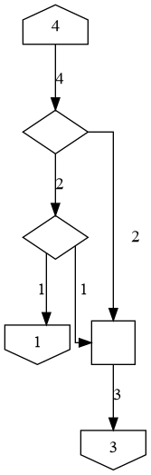
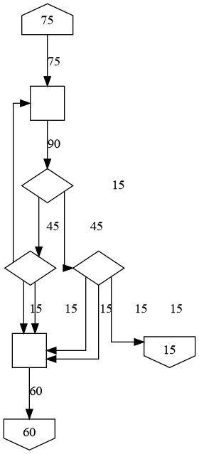
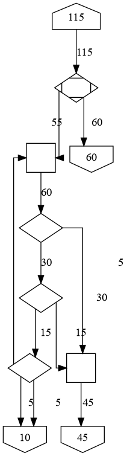
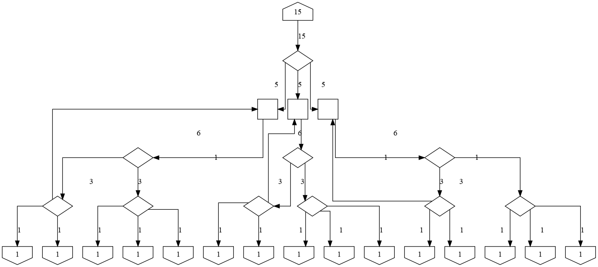
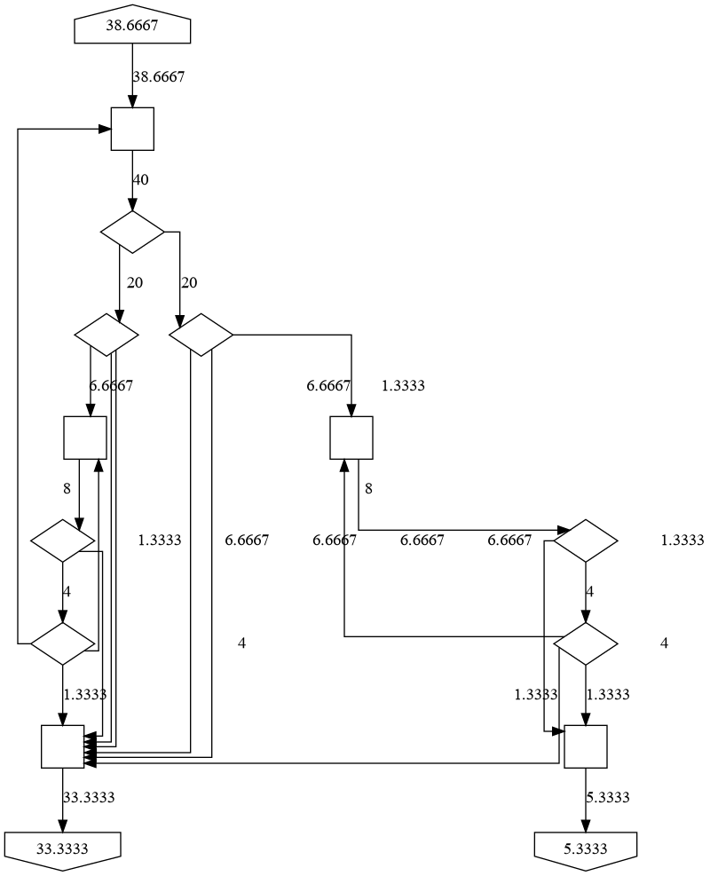

# Satisfactory Splitter Calculator

A tool to help calculate how to split conveyors in Satisfactory into specific ratios.

## Dependencies
[Python 3.9](https://python.org)

### Just JSON Output (via api.py)
Nothing else, everything used is built into python.

### Generating Graphs (via cli.py)

``pip install -r requirements.txt``

#### requirements.txt contains:

[PyYAML](https://pypi.org/project/PyYAML/)  |  Can be removed if you really want to, just search for `REMOVE YAML` comments.

[Python Graphviz](https://pypi.org/project/PyYAML/) (Note: Requires actual Graphviz, more details on pypi.)
If you want to, you can find another way to graph the output, but at that point use api.py

## Usage

### JSON Output
Run `api.py` in some sort of console / shell. Just enter the desired outputs as arguments (if ony one is present, evenly splits).
Other flags allow for customization of highest available default belt, alternate belts, max splits per splitter, max merges, and a save to file.
Check `-h` or `--help` for more details.

Ex:
```shell
python api.py 1 2 3 -b 4
python api.py 60 120 --belts 30 60 120
python api.py 8
python api.py 10/3 2.75
```
(Fractions can be input as a decimal or `N/M` where `N` and `M` are ints)

### Graph Output
You can run `cli.py` with all the same arguments as `api.py` above, with additional options for layout engine, line type, and output file type.

Alternatively, you can run it with a config file. 
Run `cli.py` with a YAML file as the first argument.
```bash
python cli.py my_yaml.yaml
```
or just drag and drop the YAML onto `cli.py` so that it "Opens With" the python file.
(Note: Files onto `conveyor_nodes.py` still works / does the same thing as onto `cli.py`)

### YAML File
The YAML File is broken into multiple parts, broken up by `---`. The first is the config section, that holds the options available to change how the program will calculate and show its output.

The second section is where you put what it is going to do. There are currently only three things that can go in here.
```yaml
Calculate: output_filename    # This tell it to calculate the values in the next section and output to output_filename.
Save Nodes: Yes    # If Calculate is present, will additionally save to output_filename.yaml all the nodes used for the output.
Graph: output_filename    # This will try reloading nodes from the next section. Automatically set in file created by Save Nodes.
```

The third / last section is the ratio input. If you would like to just evenly split a belt into N outputs:
```yaml
- N    # Where N is the desired amount of outputs. N should be an integer or it will fail.
```
Otherwise, put in how much to give to each output and put floats / decimals in as fractions or mixed numbers. Decimal numbers should work decently, there still may be issues, especially with a lot a decimal places. Repeating decimals like 1.3̅ will be inaccurate unless given as a fraction.
```yaml
# Example of 3:5
- 3
- 5
    
[3, 5]  # Alternate

# Example of a fraction (3/5):
- - 3
  - 5
      
- [3, 5]  # Alternate

# Example of mixed number (7 5/9):
- - 7
  - 5
  - 9
      
- [7, 5, 9]  # Alternate

# Can also be used to get N outputs showing value X, example 5 of 12:
- 12
- 12
- 12
- 12
- 12

[12, 12, 12, 12, 12]  # Alternate
```

Can also be a JSON if it follows the sections being elements in a list, and it's filename ends with `.json`

## Output

### JSON
Will be a JSON printed to the cli unless told to save to a file. It will be a list with two elements.
The first element is a dict with nested dicts (a.k.a. JSON Objects) to represent the nodes, while the second is a list of lists for the connections (to, from, amount).

Output Template:

```YAML
[
    {
        "NodeID": {
            "in sum": [Numerator, Denominator],  # Total amount of input
            "out sum": [Numerator, Denominator],  # Total amount of output
            "in links": int,  # Total number of input connections
            "out links": int,  # Total number of output connections
            "depth": int,  # How far down the line the node is.
            "type": string  # Type of node, (should only be "Source", "Splitter", "Merger" or "Destination")
        }
    }, 
    [
        [SourceID, DestinationID, (Carrying)[Num, Denom]]
    ]
]
```

### Graphviz
Output is done with a Graphviz Digraph. From each node, there is an arrow pointing to where it goes. The arrow should be labeled, but it may be hard on some outputs to associate a number with a node.
When graphing, nodes are displayed in a few different ways depending on what it represents.

By Default, the house and inverted houses are Inputs and Output respectively.
Diamonds are for splitters while diamonds with lines inside are smart splitters set to send everything down some belt amount with overflow for the rest.
Squares are mergers. Currently, a chain of mergers will be condensed into a single merger, but I may change/fix that in the future.

Some examples:







It is likely still not perfect and I recommend checking that it makes sense. Mainly the sum of the inputs match the sum of the outputs and that the inputs and outputs are what you expect.

## Planned Additions & Contributing
There's only three more things I'm really considering adding to this project. Those being 1) Being able to set how many belts can converge on one merger, 2) Being able to take N inputs to M outputs, and 3) some sort of GUI (Web/Django and/or Download/Tkinter) (would be bare bones).
Besides that and polishing, I don't plan to do anything else.

I don't really have experience collaborating through GitHub, but you are welcome to submit a pull request. Good luck though, I tried keeping it clean, but some places are better than others and documentation / comments still need some work. (I'll get to it eventually (probably)).

## License
[MIT](https://choosealicense.com/licenses/mit/)
