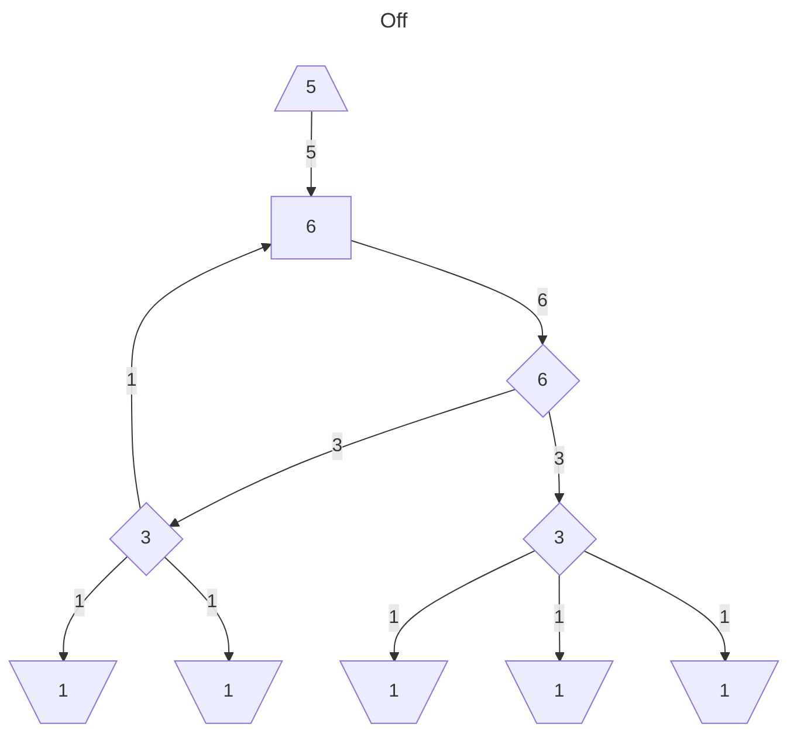
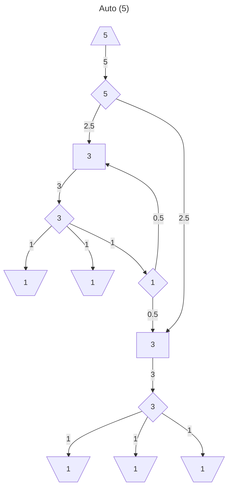
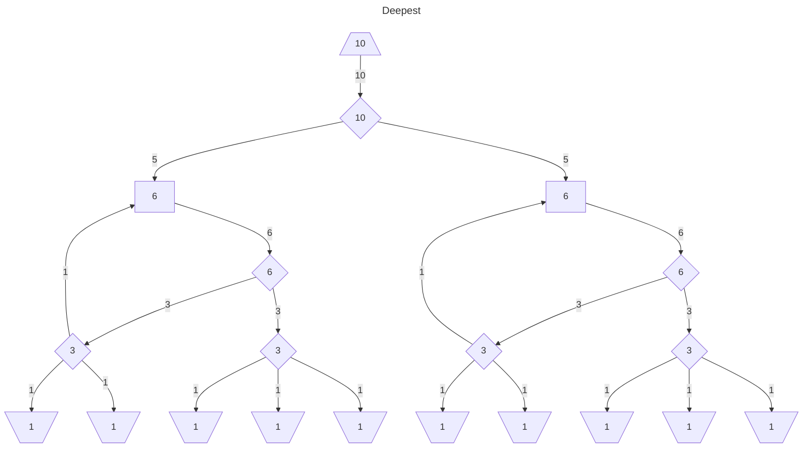
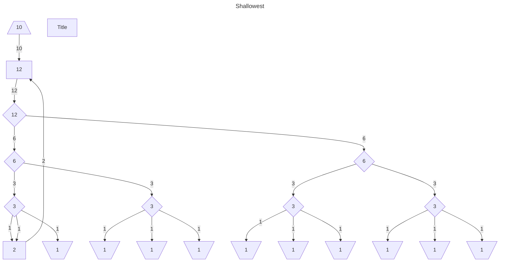
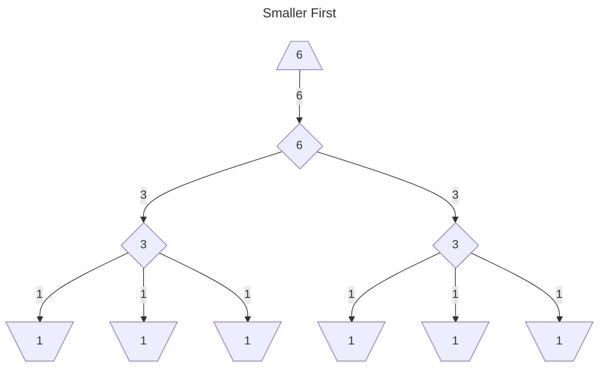
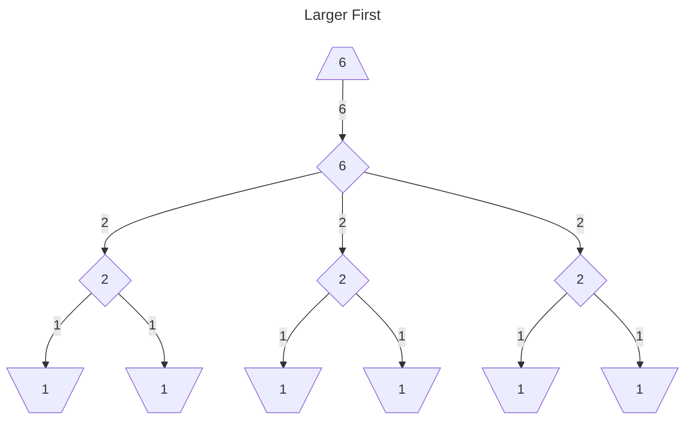

# Satisfactory Splitter Calculator
A tool to help calculate how to split conveyors in Satisfactory into specific ratios.

> [!NOTE]
> A [manifold](https://satisfactory.wiki.gg/wiki/Manifold) can be used in most, if not all,
> use cases for this project.
> That doesn't mean you shouldn't / can't use balancers. 
> Play the game however *you* want to play.&emsp;(°◡°♡)

## Usage
Free to use on [GitHub Pages](https://icemoonmagic.github.io/Satisfactory-Splitter-Calculator/)

### Split Ratio
Sources are your input belts (in items per minute), targets are your output belts.
If these don't match up, it will be corrected by adding the difference to the lesser side.

Inputs must be greater than 0 for it to work.
Aso, changing the order of sources and targets may result in larger or smaller graphs.

> [!NOTE]
> This is similar to a [belt balancer](https://satisfactory.wiki.gg/wiki/Balancer#Belt_balancer), 
> but allowing differing output amounts.

> [!IMPORTANT]
> This *will not* guarantee that items from all inputs make it to all outputs.
> Just that if fed the specified items/min per input, it will output the specified items/min per output.

The resulting graph tends to vary depending on the order of the lists. 
To help with that, there is an option to "Calculate all permutations and show simplest".
This will run the calculation on every possible way to order both inputs and outputs, 
taking the one with smallest number of nodes + number of edges. 
(Does not try different values for the [Extra Options](#extra-options)).

E.g. [1, 2, 3] -> [[1, 2, 3], [1, 3, 2], [2, 1, 3], [2, 3, 1], [3, 1, 2], [3, 2, 1]].

> [!CAUTION]
> The number of permutations here is factorial(number of inputs) * factorial(number of outputs), 
> which gets *very* big *very* fast, which will make it take a *very* long time.
> The option to enable shows how many permutations there are.

### Split Evenly
Similar to `Split Ratio`, will break the sources into `N` outputs (where `N` equals the sum of the sources).

> [!NOTE]
> This is a [load balancer](https://satisfactory.wiki.gg/wiki/Balancer#Load_balancer).

### Extra Options
#### Max Items / Min
When merging a loop back belt, the resulting belt may be carrying more than the original input.
This can cause a problem if that belt is already at its capacity.
There is an alternate way to merge the loop back in this case, which is *slightly* more complex. 
An example of the difference can be found on the 
[Satisfactory Wiki](https://satisfactory.wiki.gg/wiki/Balancer#/media/File:Balancer_odd.png).

To get the solver to use it, set the maximum available belt speed and 
the solver will replace loop back belts that surpass that maximum.
To ensure the solver doesn't try fixing belts that it can't, 
the minimum belt speed is set to the largest Source / Target.

 Example 

#### Merge Level
When choosing where to place a loop back merger, there are multiple ways they can be placed.
This option allows to set how many splitters down the merger must be placed by.

When set to `Shallowest` or `0`, all loops will be merged before any splitter 
(besides `Max Items / Min` changing this after the fact).
When set to `Deepest`, all loops will be merged as far down the tree as they can be evenly distributed.

 Example 

#### Spit Smaller First
The algorithm now finds the prime factorization of what needs to be split.
While the old algorithm preferred splitting by 2 whenever possible, 
this change allows splitting in "reverse" order.
With `Split Smaller First` off, it will split by the largest factor first.

 Example 

### Outputs
The output for Split Ratio and Split Evenly can be displayed with 
either [Graphviz](https://www.graphviz.org/) 
or [Mermaid](mermaid.js.org). 
Both provide a rendered SVG along with the associated input text.
Mermaid also now has an extra option of using the ELK Renderer. 
This will give nice straight lines with right angles.

The text can be saved as a `.dot` or `.mmd` file for Graphviz and Mermaid respectively.
However, the files are still plain text, so they can safely be renamed to `.txt`. 
Additionally, a button links to online editors, 
[dreampuf's GraphvizOnline](https://github.com/dreampuf/GraphvizOnline) for Graphviz 
and [Mermaid's Live Editor](https://mermaid.live).

At this time, downloading the graph as a PNG or SVG are not implemented. 
However, both online editors support this functionality.

It *should* all work out, but it's a good idea to validate it before commiting to the result.
If you find a case where it fails, 
open an [issue](https://github.com/IceMoonMagic/Satisfactory-Splitter-Calculator/issues) 
so it can be fixed.

### Machine Count
Determines the number of machines needed to split `Clock Speed` evenly while still totaling `Clock Speed`
given [Satisfactory's Precision](https://satisfactory.fandom.com/wiki/Clock_speed#Precision). 
Provides number of machines and clock speed.

This is based on the assumption of 4 decimal places of precision 
(6 if using clock speed as a decimal).

## How It Works

 How It Works 

### Ratio-ing
The algorithm works on the assumption that the smallest number is `1`.
To fulfill this assumption, the inputs may need to be re-adjusted.

Using some "fun" math, the lowest common denominator 
(or, more accurately, lowest common multiple of the denominators)
is found and made to the denominator of each input.
After that, the greatest common factor is found and used as a divisor to get the final simplified ratio.

This an input of `[60] -> [30, 15, 15]` be reduced to `[4] -> [2, 1, 1]`.
It also makes `[0.5, 0.5] -> [0.75, 0.25]` into `[2, 2] -> [3, 1]`

### Splitting
The inputs are then split into `N` equal parts (where `N` is the sum of the sources).
Each Source is split independently in this stage.

The first sub-step is determining the prime factorization of the Source.
If there are prime factors that aren't `2` or `3`, 
the next number that does only have prime factors of `2` or `3` is found,
the (M) difference is noted, and the splitting will use this new number.

Given the prime factorization (now only having `2` or `3`),
a tree is built by dividing each new leaf by the next factor.
Normally, the factors are in ascending order,
but there is [an option](#spit-smaller-first) to make it descending order instead.

In the case that M is not 0, M is also divided by these factors as the tree is building.
If Mk  is not divisible by the next factor 
(or as dictated by [Merge Level](#merge-level)),
a merger is placed with to fill in Mk for that branch.

While the current algorithm basically fills the mergers in this step,
it's technically part of the next step.
This is so that the next step *could be* modified to consider those mergers
when merging into final outputs.

### Merging
Given an array of the leaf nodes,
`M` nodes are taken to be merged (where `M` equals one of the targets).
These nodes could just be merged together, 
but that would likely leave a lot of redundant nodes that get split just to be merged together again. 

To fix this, before merging, the parent of a node to be merged is looked at. 
If all of this parent's children are set to be merged, 
the children are disconnected and dismissed from merging while the parent is set in their place.
This continues until all the nodes either have no parent 
or all nodes have children that are excluded from merging.

If a child that is feeding a "back node" is checking itself, 
all the children of the "back node" must also be set for merging.

### Graphing
The `ConveyorNode`s and `ConveyorLink`s that are used internally represent nodes and edges respectfully 
(for graphing purposes at least), 
but need to be converted to work with [the outputs](#outputs). 
This is done simply by iterating over each root and recursing through their children, 
recording the nodes and edges along the way. 
Afterwords, the noted nodes / edges' are data are converted to what the selected output needs.

## *Possible* Future Additions
- Re-Implement using smart splitters to simplify outputs (like in Python Version)
- Splitter "Playground", allowing manual editing of graph

## Development
This project uses Vue 3 + TypeScript + Vite and deploys to GitHub Pages.

### Dependencies
- `@heroicons/vue`: Icons
- `@viz-js/viz`: Graphviz Renderer
- `decimal.js`: Precise math, avoiding issues with float
- `js-base64`: Required for a step for sending to [Mermaid.live](https://mermaid.live)
- `pako`: Required for a step for sending to [Mermaid.live](https://mermaid.live)
- `vis-data`: (WIP) Interactable output graph
- `vis-netowrk`: (WIP) Interactable output graph
- `vue`: The UI framework
- `vue-mermaid-string`: Convenient component for rendering Mermaid
- Dev
    - `@catppuccin/tailwindcss`: Catppuccin Colors
    - `@types/pako`: Typing for `pako`
    - `@vitejs/plugin-vue`: Vite + Vue
    - `@vue/language-server`: Language support in WebStorm
    - `autoprefixer`: Something relating to Tailwind CSS
    - `postcss`: Something relating to Tailwind CSS
    - `prettier`: Consistent code style
    - `prettier-plugin-organize-attributes`: Consistent HTML attribute order
    - `prettier-plugin-tailwindcss`: Consistent TailwindCSS class order
    - `rollup-plugin-visualizer`: Visualize bundle chunks
    - `tailwindcss`: Styling
    - `typescript`: TypeScript
    - `vite`: Bundler
    - `vitest`: Automated Testing
    - `vue-tsc`: Vue + TS

VS-Code Plugins:
- [Vue - Official](https://marketplace.visualstudio.com/items?itemName=Vue.volar)
- [Tailwind CSS IntelliSense](https://marketplace.visualstudio.com/items?itemName=bradlc.vscode-tailwindcss)
- [Prettier - Code formatter](https://marketplace.visualstudio.com/items?itemName=esbenp.prettier-vscode)

## Contributing
Anyone is welcome to open an issue or pull request.
Pull requests will not be accepted until all validation succeeds
(files follow Prettier and all Vitest tests pass).

Licensed with the [MIT License](https://choosealicense.com/licenses/mit/).